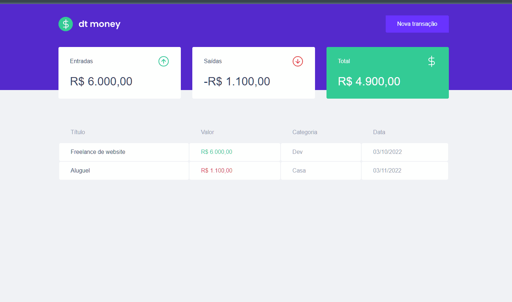

<!-- Subtitle -->
<h2 align="center"> ( DT Money ) </h2>


<!-- Sobre o Projeto -->
## 🚀 Sobre o Projeto
<br />
<br />

<strong>DTmoney</strong> é uma aplicação web que calcula o fluxo financeiro pessoal de um usuário a partir de dados de transações imputados pelo mesmo.

Esse projeto foi desenvolvido com o intuito de aprofundar conhecimentos em front-end utilizando a biblioteca <strong>React</strong>, no curso Ignite da [@Rocketseat](https://github.com/Rocketseat).

<br />
<br />
<br />


## 🖼️ Preview

<br />

<div align="center">
  
</div>


<br />
<br />

## 🧰 Tecnologias e Bibliotecas

<br />
<br />

* [ReactJS](https://pt-br.reactjs.org/tutorial/tutorial.html)
  * [Styled Component](https://www.npmjs.com/package/styled-components) - Biblioteca CSS in JS
  * [Axios](https://www.npmjs.com/package/axios)
  * [React Modal](https://www.npmjs.com/package/react-modal)
  * [Polished](https://www.npmjs.com/package/polished)
* [TypeScript](https://www.typescriptlang.org/)

<br />
<br />

### Tools para criar API Fake
 * [MirageJS]()

 <br />
<br />

## ⚙️ Rodando o Projeto
```bash
# Clone este repositório para a pasta anterior
$ git clone https://github.com/Italo-Maia/dt-money.git
# ou use a opção de download.

# Acesse a pasta dtmoney
$ cd dt-money

# Instale as dependências
$ npm install

# Executando o Projeto
$ npm start

```
